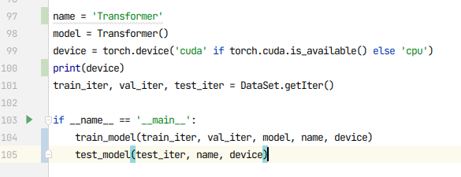
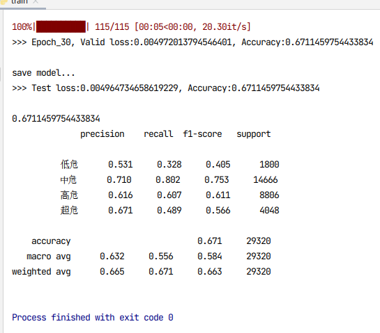
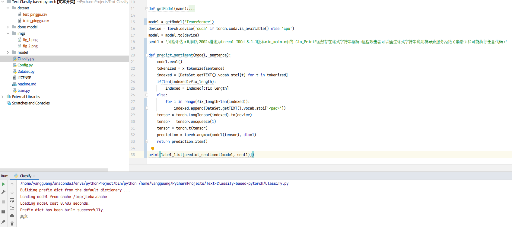

# 基于深度学习Pytorch框架的文本分类

## 1、修改配置文件

在config.py文件中对常规参数进行修改。

```python
# data preprocess
data_path = 'dataset'
train_file = 'train.csv'
valid_file = 'valid.csv'
test_file = 'test.csv'
fix_length = 256
batch_size = 64
# data label list
label_list = ['低危', '中危', '高危', '超危']
class_number = len(label_list)
# train details
epochs = 30
learning_rate = 1e-3
```

其中，fix_length需要自己统计出数据集中的文本长度分布比例，进行合适的参数选择。batch_size需要根据显卡的显存大小进行参数选择。label_list需要换成对应数据集的标签列表。

## 2、选择合适的模型

在train.py中修改模型和模型命名。分别在97和98行进行修改。



## 3、模型

- [x] TextCNN
- [x] TextRNN
- [x] TextRNN+Attention
- [x] TextRCNN
- [x] Transformer
- [ ] Some other attention
- [ ] Bert之类的预训练模型开在另一个仓库下

模型都直接定义在model/目录下，在forward最后返回的out的形状应该是[batch size, num_classes]这样的。

## 4、训练
模型中的超参数，例如hidden_size, multi_heads, n_layers需要自行修改。

修改完train.py中上述2处直接run就行，训练好的模型将保存在done_model/目录下。



## 5、使用训练好的模型进行文本分类

修改Classify.py中   model = getModel('Transformer')   ，模型改为之前训练好的模型名称。

然后直接run Classify.py就行。


